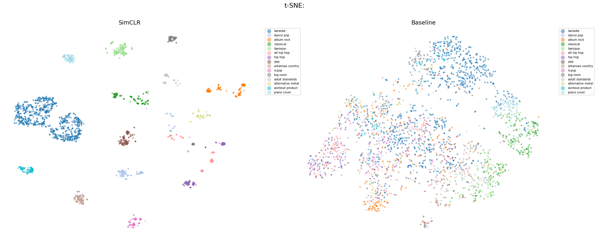
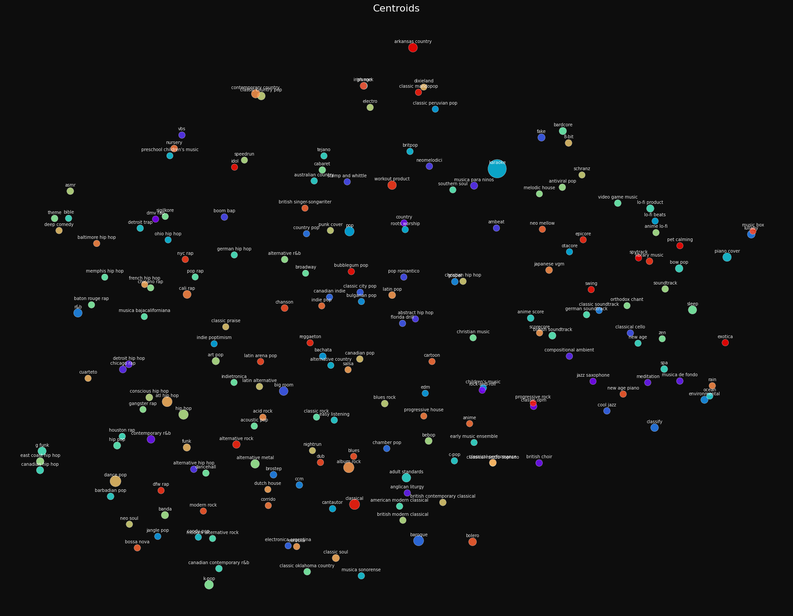

# Spotify-SimCLR: Content-Based Music Recommendation Engine


## Project Objective

This repository implements the core embedding engine for a **content-based Music Recommendation System**. The primary goal is to generate highly representative, low-dimensional vectors (embeddings) for over 200,000 Spotify tracks using their raw tabular audio features (e.g., tempo, energy, valence).

To achieve this without relying on explicit genre labels during training, the project utilizes **SimCLR** (A Simple Framework for Contrastive Learning of Visual Representations), adapted specifically for tabular data. The resulting latent space allows for efficient similarity search, serving as the backbone for music recommendations.

---

## Results Summary

| Metric | Baseline (Raw Features) | SimCLR Embeddings |
| :--- | :---: | :---: |
| **Silhouette Score** | -0.7224 | **+0.3431** |

> The shift from a highly negative to a positive Silhouette score proves the Contrastive Learning objective successfully transformed a chaotic feature space into dense, well-separated clusters of similar tracks.

### KNN Genre Precision across K

| K | SimCLR | Baseline | Δ |
| :---: | :---: | :---: | :---: |
| 5 | 0.7709 | 0.0803 | **+0.6906** |
| 20 | 0.5769 | 0.0642 | **+0.5127** |
| 50 | 0.4371 | 0.0546 | **+0.3825** |

> Precision naturally decreases as K grows, but SimCLR embeddings consistently outperform the raw feature baseline by a large margin across all retrieval depths.

---

## SimCLR Adaptation for Tabular Data

Adapting SimCLR from computer vision to tabular audio features requires a specific approach to augmentation and network design.

### Architecture Flow

```
Raw Tabular Audio Features (e.g., tempo, energy, acousticness)
       │
       ├──► [View 1: Gaussian Noise + Masking] ─────┐
       │                                            │
       └──► [View 2: Feature Dropout + Jitter] ───┐ │
                                                  │ │
               ┌─────────────────────────────────-┴─┴─┐
               │          Encoder (Deep MLP)           │
               │   (Linear → BatchNorm1d → ReLU)       │
               └──────────────────┬────────────────────┘
                                  │ Representation (h)
               ┌──────────────────▼────────────────────┐
               │         Projector (Linear MLP)        │
               └──────────────────┬────────────────────┘
                                  │ Embedding (z)
                     [ NT-Xent Contrastive Loss ]
```

### Tabular Augmentations

Unlike images (where we can crop or color-jitter), audio metadata requires domain-specific augmentations to create positive pairs:

**Feature Masking (Dropout)** — randomly zeroing out certain features forces the model to reconstruct the track's vibe from incomplete data.

**Gaussian Noise Injection** — adding slight numerical noise to continuous variables (like loudness or tempo) simulates natural acoustic variations, preventing the model from simply memorizing exact values.

### Training Hyperparameters

| Parameter | Value |
| :--- | :--- |
| Optimizer | Adam |
| Loss Function | NT-Xent (Normalized Temperature-scaled Cross Entropy) |
| Mixed Precision | `torch.cuda.amp` |
| Gradient Clipping | `max_norm=1.0` |
| Batch Size | 4096 |
| Learning Rate | 1.6e-3 |
| Temperature (τ) | 0.3 |

---

## Visualizing the Latent Space

To qualitatively assess the embedding space, the 128-dimensional vectors were projected into 2D using **t-SNE**.

### Track Distribution Mapping

This visualization confirms the model's capacity to resolve high-dimensional tabular features into distinct, cohesive groups. The clear separation of colors (genres) indicates effective capture of the dataset's acoustic topology.



### Semantic Distances (Genre Centroids)

By plotting the geometric centers (centroids) of each genre, this graph visually represents how the recommendation engine calculates acoustic distances between broad musical categories.



---

## Dataset

This project uses the [`spotify-dataset-2023`](https://www.kaggle.com/datasets/tonygordonjr/spotify-dataset-2023) dataset from Kaggle.

---

## Future Work

**Vector Database Integration** — replace standard Scikit-learn KNN with [FAISS](https://github.com/facebookresearch/faiss).